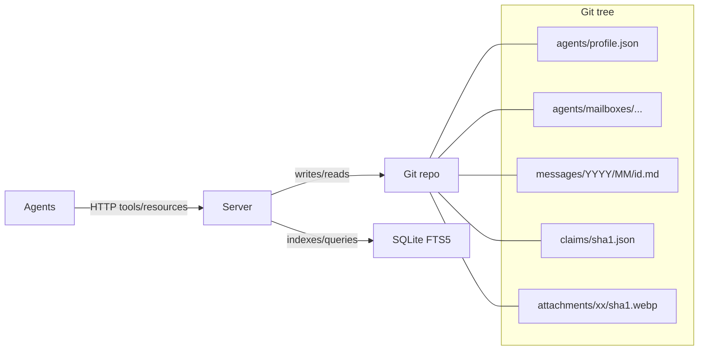
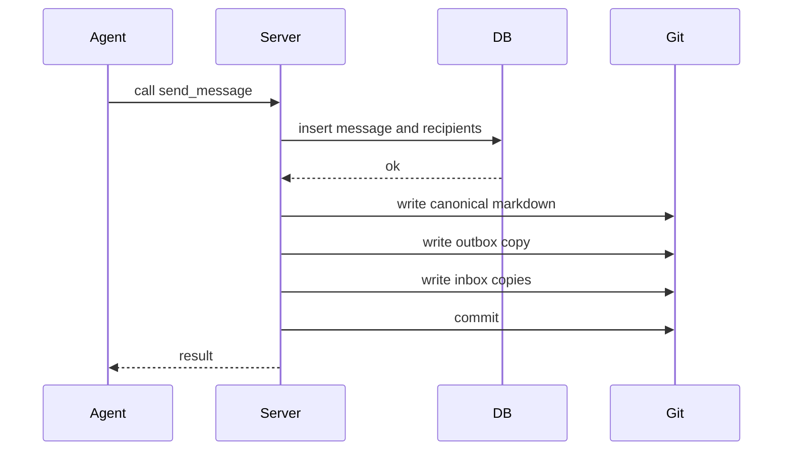
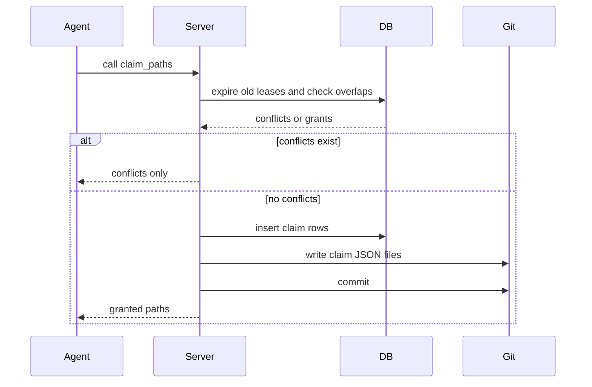
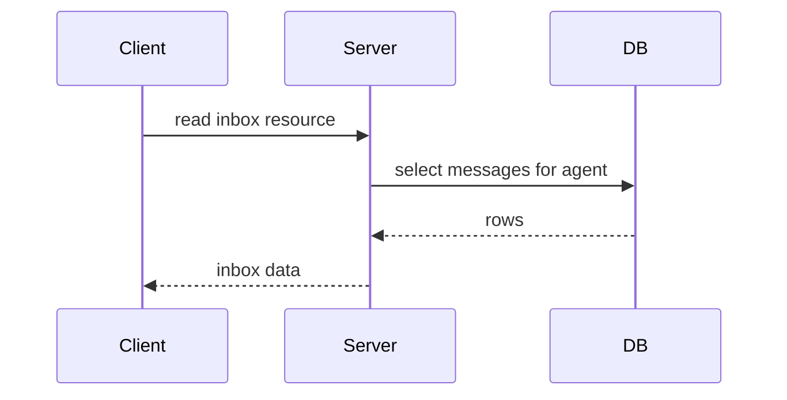

# mcp-agent-mail

A mail-like coordination layer for coding agents, exposed as an HTTP-only FastMCP server. It gives agents memorable identities, an inbox/outbox, searchable message history, and voluntary file reservation "leases" to avoid stepping on each other.

Think of it as asynchronous email + directory + change-intent signaling for your agents, backed by Git (for human-auditable artifacts) and SQLite (for indexing and queries).

Status: Under active development. The design is captured in detail in `project_idea_and_guide.md` (start with the original prompt at the top of that file).

## Why this exists

Modern projects often run multiple coding agents at once (backend, frontend, scripts, infra). Without a shared coordination fabric, agents:

- Overwrite each other’s edits or panic on unexpected diffs
- Miss critical context from parallel workstreams
- Require humans to “liaison” messages across tools and teams

This project provides a lightweight, interoperable layer so agents can:

- Register a temporary-but-persistent identity (e.g., GreenCastle)
- Send/receive GitHub-Flavored Markdown messages with images
- Search, summarize, and thread conversations
- Declare advisory file reservations (leases) on files/globs to signal intent
- Inspect a directory of active agents, programs/models, and activity

It’s designed for: FastMCP clients and CLI tools (Claude Code, Codex, Gemini CLI, etc.) coordinating across one or more codebases.

## Core ideas (at a glance)

- HTTP-only FastMCP server (Streamable HTTP). No SSE, no STDIO.
- Dual persistence model:
  - Human-readable markdown in a per-project Git repo for every canonical message and per-recipient inbox/outbox copy
  - SQLite with FTS5 for fast search, directory queries, and file reservations/leases
- "Directory/LDAP" style queries for agents; memorable adjective+noun names
- Advisory file reservations for editing surfaces; optional pre-commit guard
- Resource layer for convenient reads (e.g., `resource://inbox/{agent}`)

## Typical use cases

- Multiple agents splitting a large refactor across services while staying in sync
- Frontend and backend teams of agents coordinating thread-by-thread
- Protecting critical migrations with exclusive file reservations and a pre-commit guard
- Searching and summarizing long technical discussions as threads evolve
- Discovering and linking related projects (e.g., frontend/backend) through AI-powered suggestions

## Architecture



```
Coding Agents (various CLIs)
        |  HTTP (Streamable) tools/resources
        v
  mcp-agent-mail (FastMCP server)
        |                                   
        | writes/reads                             indexes/queries
        v                                          v
Per-project Git repo (.mcp-mail/)           SQLite (FTS5)
  ├─ agents/<AgentName>/{inbox,outbox}/     agents/messages/claims
  ├─ agents/<AgentName>/profile.json
  ├─ messages/YYYY/MM/<msg-id>.md (canonical)
  └─ claims/<sha1-of-path>.json
```

## Web UI (human-facing mail viewer)

The server ships a lightweight, server‑rendered Web UI for humans. It lets you browse projects, agents, inboxes, single messages, attachments, file reservations, and perform full‑text search with FTS5 when available (with an automatic LIKE fallback).

- Where it lives: built into the HTTP server in `mcp_agent_mail.http` under the `/mail` path.
- Who it’s for: humans reviewing activity; agents should continue to use the MCP tools/resources API.

### Launching the Web UI

Start the HTTP server (the UI is mounted automatically):

```bash
uv run python -m mcp_agent_mail.http --host 127.0.0.1 --port 8765
# then open http://127.0.0.1:8765/mail
```

Alternative (ASGI factory):

```bash
uv run uvicorn mcp_agent_mail.http:build_http_app --factory --host 127.0.0.1 --port 8765
```

Auth notes:
- GET pages in the UI are not gated by the RBAC middleware (it classifies POSTed MCP calls only), but if you set a bearer token the separate BearerAuth middleware protects all routes by default.
- For local dev, set `HTTP_ALLOW_LOCALHOST_UNAUTHENTICATED=true` (and optionally `HTTP_BEARER_TOKEN`), so localhost can load the UI without headers.
- Health endpoints are always open at `/health/*`.

### Routes and what you can do

- `/mail` (Projects index + Related Projects Discovery)
  - Lists all projects (slug, human name, created time) from SQLite.
  - Suggests **likely sibling projects** when two slugs appear to be parts of the same product (e.g., backend vs. frontend). Suggestions are ranked with heuristics and, when `LLM_ENABLED=true`, an LLM pass across key docs (`README.md`, `AGENTS.md`, etc.).
  - Humans can **Confirm Link** or **Dismiss** suggestions from the dashboard. Confirmed siblings become highlighted badges but *do not* automatically authorize cross-project messaging—agents must still establish `AgentLink` approvals via `request_contact`/`respond_contact`.
  - Quick stats placeholders; click a project to drill in.

- `/mail/{project}` (Project overview + search + agents)
  - Rich search form with filters:
    - Scope: subject/body/both, Order: relevance or time, optional “boost subject”.
    - Query tokens: supports `subject:foo`, `body:"multi word"`, quoted phrases, and bare terms.
    - Uses FTS5 bm25 scoring when available; otherwise falls back to SQL LIKE on subject/body with your chosen scope.
  - Results show subject, sender, created time, thread id, and a highlighted snippet when using FTS.
  - Agents panel shows registered agents for the project with a link to each inbox.
  - Quick links to File Reservations and Attachments for the project header.

- `/mail/{project}/inbox/{agent}` (Inbox for one agent)
  - Reverse‑chronological list with subject, sender, created time, importance badge, thread id.
  - Pagination (`?page=N&limit=M`).

- `/mail/{project}/message/{id}` (Message detail)
  - Shows subject, sender, created time, importance, recipients (To/Cc/Bcc), thread messages.
  - Body rendering:
    - If the server pre‑converted markdown to HTML, it’s sanitized with Bleach (limited tags/attributes, safe CSS via CSSSanitizer) and then displayed.
    - Otherwise markdown is rendered client‑side with Marked + Prism for code highlighting.
  - Attachments are referenced from the message frontmatter (WebP files or inline data URIs).

- `/mail/{project}/search?q=...` (Dedicated search page)
  - Same query syntax as the project overview search, with a token “pill” UI for assembling/removing filters.

- `/mail/{project}/claims` (File Reservations list)
  - Displays active and historical file reservations (exclusive/shared, path pattern, timestamps, released/expired state).

- `/mail/{project}/attachments` (Messages with attachments)
  - Lists messages that contain any attachments, with subject and created time.
  
- `/mail/unified-inbox` (Cross-project activity)
  - Shows recent messages across all projects with thread counts and sender/recipients.

### Related Projects Discovery

The Projects index (`/mail`) features an **AI-powered discovery system** that intelligently suggests which projects should be linked together—think frontend + backend, or related microservices.

#### How Discovery Works

**1. Smart Analysis**
The system uses multiple signals to identify relationships:
- **Pattern matching**: Compares project names and paths (e.g., "my-app-frontend" ↔ "my-app-backend")
- **AI understanding** (when `LLM_ENABLED=true`): Reads `README.md`, `AGENTS.md`, and other docs to understand each project's purpose and detect natural relationships
- **Confidence scoring**: Ranks suggestions from 0-100% with clear rationales

**2. Beautiful Suggestions**
Related projects appear as polished cards on your dashboard with:
- 🎯 Visual confidence indicators showing match strength
- 💬 AI-generated rationales explaining the relationship
- ✅ **Confirm Link** — accept the suggestion
- ✖️ **Dismiss** — hide irrelevant matches

**3. Quick Navigation**
Once confirmed, both projects display interactive badges for instant navigation between related codebases.

#### Why Suggestions, Not Auto-Linking?

> **TL;DR**: We keep you in control. Discovery helps you find relationships; explicit approvals control who can actually communicate.

**Agent Mail uses agent-centric messaging** — every message follows explicit permission chains:

```
Send Message → Find Recipient → Check AgentLink Approval → Deliver
```

This design ensures:
- **Security**: No accidental cross-project message delivery
- **Transparency**: You always know who can talk to whom
- **Audit trails**: All communication paths are explicitly approved

**Why not auto-link with AI?**
If we let an LLM automatically authorize messaging between projects, we'd be:
- ❌ Bypassing contact policies without human oversight
- ❌ Risking message misdelivery to unintended recipients
- ❌ Creating invisible routing paths that are hard to audit
- ❌ Potentially linking ambiguously-named projects incorrectly

Instead, we give you **discovery + control**:
- ✅ AI suggests likely relationships (safe, read-only analysis)
- ✅ You confirm what makes sense (one click)
- ✅ Agents still use `request_contact` / `respond_contact` for actual messaging permissions
- ✅ Clear separation: discovery ≠ authorization

#### The Complete Workflow

```
1. System suggests: "These projects look related" (AI analysis)
           ↓
2. You confirm: "Yes, link them" (updates UI badges)
           ↓
3. Agents request: request_contact(from_agent, to_agent, to_project)
           ↓
4. You approve: respond_contact(accept=true)
           ↓
5. Messages flow: Agents can now communicate across projects
```

**Think of it like LinkedIn**: The system suggests connections, but only *you* decide who gets to send messages.

### Search syntax (UI)

The UI shares the same parsing as the API’s `_parse_fts_query`:
- Field filters: `subject:login`, `body:"api key"`
- Phrase search: `"build plan"`
- Combine terms: `login AND security` (FTS)
- Fallback LIKE: scope determines whether subject, body, or both are searched

### Prerequisites to see data

The UI reads from the same SQLite + Git artifacts as the MCP tools. To populate content:
1) Ensure a project exists (via tool call or CLI):
   - Ensure/create project: `ensure_project(human_key)`
2) Register one or more agents: `register_agent(project_key, program, model, name?)`
3) Send messages: `send_message(...)` (attachments and inline images are supported; images may be converted to WebP).

Once messages exist, visit `/mail`, click your project, then open an agent inbox or search.

### Implementation and dependencies

- Templates live in `src/mcp_agent_mail/templates/` and are rendered by Jinja2.
- Markdown is converted with `markdown2` on the server where possible; HTML is sanitized with Bleach (with CSS sanitizer when available).
- Tailwind CSS, Lucide icons, Alpine.js, Marked, and Prism are loaded via CDN in `base.html` for a modern look without a frontend build step.
- All rendering is server‑side; there’s no SPA router. Pages degrade cleanly without JavaScript.

### Security considerations

- HTML sanitization: Only a conservative set of tags/attributes are allowed; CSS is filtered. Links are limited to http/https/mailto/data.
- Auth: Use bearer token or JWT when exposing beyond localhost. For local dev, enable localhost bypass as noted above.
- Rate limiting (optional): Token‑bucket limiter can be enabled; UI GET requests are light and unaffected by POST limits.

### Troubleshooting the UI

- Blank page or 401 on localhost: Either unset `HTTP_BEARER_TOKEN` or set `HTTP_ALLOW_LOCALHOST_UNAUTHENTICATED=true`.
- No projects listed: Create one with `ensure_project`.
- Empty inbox: Verify recipient names match exactly and messages were sent to that agent.
- Search returns nothing: Try simpler terms or the LIKE fallback (toggle scope/body).


### On-disk layout (per project)

```
<store>/projects/<slug>/repo/
  agents/<AgentName>/profile.json
  agents/<AgentName>/inbox/YYYY/MM/<msg-id>.md
  agents/<AgentName>/outbox/YYYY/MM/<msg-id>.md
  messages/YYYY/MM/<msg-id>.md
  claims/<sha1-of-path>.json
  attachments/<xx>/<sha1>.webp
```

### Message file format

Messages are GitHub-Flavored Markdown with JSON frontmatter (fenced by `---json`). Attachments are either WebP files referenced by relative path or inline base64 WebP data URIs.

```markdown
---json
{
  "id": "msg_20251023_7b3dc3a7",
  "thread_id": "TKT-123",
  "project": "/abs/path/backend",
  "from": "GreenCastle",
  "to": ["BlueLake"],
  "cc": [],
  "created": "2025-10-23T15:22:14Z",
  "importance": "high",
  "ack_required": true,
  "attachments": [
    {"type": "file", "media_type": "image/webp", "path": "attachments/2a/2a6f.../diagram.webp"}
  ]
}
---

# Build plan for /api/users routes

... body markdown ...
```

### Data model (SQLite)

- `projects(id, human_key, slug, created_at)`
- `agents(id, project_id, name, program, model, inception_ts, task, last_active_ts)`
- `messages(id, project_id, sender_id, thread_id, subject, body_md, created_ts, importance, ack_required, attachments)`
- `message_recipients(message_id, agent_name, kind, read_ts, ack_ts)`
- `claims(id, project_id, agent_name, path, exclusive, reason, created_ts, expires_ts, released_ts)`
- `fts_messages(message_id UNINDEXED, subject, body)` + triggers for incremental updates

### Concurrency and lifecycle

- One request/task = one isolated operation; Git writes are serialized by a lock file in the project repo root
- DB operations are short-lived and scoped to each tool call; FTS triggers keep the search index current
- Artifacts are written first, then committed as a cohesive unit with a descriptive message
- Attachments are content-addressed (sha1) to avoid duplication

## How it works (key flows)

1) Create an identity

- `register_agent(project_key, program, model, name?, task_description?)` → creates/updates a named identity, persists profile to Git, and commits.

2) Send a message

- `send_message(project_key, sender_name, to[], subject, body_md, cc?, bcc?, importance?, ack_required?, thread_id?, convert_images?)`
- Writes a canonical message under `messages/YYYY/MM/`, an outbox copy for the sender, and inbox copies for each recipient; commits all artifacts.
- Optionally converts images (local paths or data URIs) to WebP and embeds small ones inline.



3) Check inbox

- `fetch_inbox(project_key, agent_name, since_ts?, urgent_only?, include_bodies?, limit?)` returns recent messages, preserving thread_id where available.
- `acknowledge_message(project_key, agent_name, message_id)` marks acknowledgements.

4) Avoid conflicts with file reservations (leases)

- `claim_paths(project_key, agent_name, paths[], ttl_seconds, exclusive, reason)` records an advisory lease in DB and writes JSON reservation artifacts in Git; conflicts are reported if overlapping active exclusives exist.
- `release_claims(project_key, agent_name, paths[])` releases active leases. JSON artifacts remain for audit history.
- Optional: install a pre-commit hook in your code repo that blocks commits conflicting with other agents' active exclusive file reservations.



5) Search & summarize

- `search_messages(project_key, query, limit?)` uses FTS5 over subject and body.
- `summarize_thread(project_key, thread_id, include_examples?)` extracts key points, actions, and participants from the thread.
- `reply_message(project_key, message_id, sender_name, body_md, ...)` creates a subject-prefixed reply, preserving or creating a thread.

### Semantics & invariants

- Identity
  - Names are memorable adjective+noun and unique per project; `name_hint` is sanitized (alnum) and used if available
  - `whois` returns the stored profile; `list_agents` can filter by recent activity
  - `last_active_ts` is bumped on relevant interactions (messages, inbox checks, etc.)
- Threads
  - Replies inherit `thread_id` from the original; if missing, the reply sets `thread_id` to the original message id
  - Subject lines are prefixed (e.g., `Re:`) for readability in mailboxes
- Attachments
  - Image references (file path or data URI) are converted to WebP; small images embed inline when policy allows
  - Non-absolute paths resolve relative to the project repo root
  - Stored under `attachments/<xx>/<sha1>.webp` and referenced by relative path in frontmatter
- File Reservations
  - TTL-based; exclusive means "please don't modify overlapping surfaces" for others until expiry or release
  - Conflict detection is per exact path pattern; shared reservations can coexist, exclusive conflicts are surfaced
  - JSON artifacts remain in Git for audit even after release (DB tracks release_ts)
- Search
  - External-content FTS virtual table and triggers index subject/body on insert/update/delete
  - Queries are constrained to the project id and ordered by `created_ts DESC`

## Tools (MCP surface)

| Tool | Purpose |
| :-- | :-- |
| `register_agent(...)` | Register a new agent identity and write `profile.json` in Git |
| `whois(project_key, agent_name)` | Enriched profile for one agent (optionally includes recent commits) |
| `create_agent_identity(project_key, program, model, name_hint?, task_description?, attachments_policy?)` | Always creates a new unique agent and writes `profile.json` |
| `send_message(...)` | Create canonical + inbox/outbox markdown artifacts and commit |
| `reply_message(...)` | Reply to an existing message and continue the thread |
| `request_contact(project_key, from_agent, to_agent, reason?, ttl_seconds?)` | Request permission to message another agent |
| `respond_contact(project_key, to_agent, from_agent, accept, ttl_seconds?)` | Approve or deny a contact request |
| `list_contacts(project_key, agent_name)` | List contact links for an agent |
| `set_contact_policy(project_key, agent_name, policy)` | Set policy: `open`, `auto` (default), `contacts_only`, `block_all` |
## Contact model and “consent-lite” messaging

Goal: make coordination “just work” without spam across unrelated agents. The server enforces per-project isolation by default and adds an optional consent layer within a project so agents only contact relevant peers.

### Isolation by project

- All tools require a `project_key`. Agents only see messages addressed to them within that project.
- An agent working in Project A is invisible to agents in Project B unless explicit cross-project contact is established (see below). This avoids distraction between unrelated repositories.

### Policies (per agent)

- `open`: accept any targeted messages in the project.
- `auto` (default): allow messages when there is obvious shared context (e.g., same thread participants; recent overlapping active file reservations; recent prior direct contact within a TTL); otherwise requires a contact request.
- `contacts_only`: require an approved contact link first.
- `block_all`: reject all new contacts (errors with CONTACT_BLOCKED).

Use `set_contact_policy(project_key, agent_name, policy)` to update.

### Request/approve contact

- `request_contact(project_key, from_agent, to_agent, reason?, ttl_seconds?)` creates or refreshes a pending link and sends a small ack_required “intro” message to the recipient.
- `respond_contact(project_key, to_agent, from_agent, accept, ttl_seconds?)` approves or denies; approval grants messaging until expiry.
- `list_contacts(project_key, agent_name)` surfaces current links.

### Auto-allow heuristics (no explicit request required)

- Same thread: replies or messages to thread participants are allowed.
- Recent overlapping file reservations: if sender and recipient hold active file reservations in the project, messaging is allowed.
- Recent prior contact: a sliding TTL allows follow-ups between the same pair.

These heuristics minimize friction while preventing cold spam.

### Cross-project coordination (frontend vs backend repos)

When two repos represent the same underlying project (e.g., `frontend` and `backend`), you have two options:

1) Use the same `project_key` across both workspaces. Agents in both repos operate under one project namespace and benefit from full inbox/outbox coordination automatically.

2) Keep separate `project_key`s and establish explicit contact:
   - In `backend`, agent `GreenCastle` calls:
     - `request_contact(project_key="/abs/path/backend", from_agent="GreenCastle", to_agent="BlueLake", reason="API contract changes")`
   - In `frontend`, `BlueLake` calls:
     - `respond_contact(project_key="/abs/path/backend", to_agent="BlueLake", from_agent="GreenCastle", accept=true)`
   - After approval, messages can be exchanged; in default `auto` policy the server allows follow-up threads/reservation-based coordination without re-requesting.

Important: You can also create reciprocal links or set `open` policy for trusted pairs. The consent layer is on by default (CONTACT_ENFORCEMENT_ENABLED=true) but is designed to be non-blocking in obvious collaboration contexts.

| Tool | Purpose |
| :-- | :-- |
| `fetch_inbox(...)` | Pull recent messages for an agent |
| `acknowledge_message(...)` | Mark a message as acknowledged by agent |
| `claim_paths(...)` | Request advisory leases on files/globs |
| `release_claims(...)` | Release existing leases |
| `search_messages(...)` | FTS5 search over subject/body |
| `summarize_thread(...)` | Extract summary/action items across a thread |
| `summarize_threads(...)` | Digest across multiple threads (optional LLM refinement) |
| `install_precommit_guard(project_key, code_repo_path)` | Install a Git pre-commit guard in a target repo |
| `uninstall_precommit_guard(code_repo_path)` | Remove the guard |

## Resource layer (read-only URIs)

Expose common reads as resources that clients can fetch:

- `resource://inbox/{agent}{?project,since_ts,urgent_only,include_bodies,limit}`
- `resource://message/{id}{?project}`
- `resource://thread/{thread_id}{?project,include_bodies}`
- `resource://views/urgent-unread/{agent}{?project,limit}`
- `resource://views/ack-required/{agent}{?project,limit}`
- `resource://views/ack-overdue/{agent}{?project,ttl_minutes,limit}`: ack-required messages older than TTL without acknowledgements
- `resource://mailbox-with-commits/{agent}{?project,limit}`: mailbox items enriched with per-message commit metadata and diff summaries (recommended)
- `resource://mailbox/{agent}{?project,limit}`: recent inbox items with a basic/heuristic commit reference (legacy/simple)
- `resource://outbox/{agent}{?project,limit,include_bodies,since_ts}`: messages sent by the agent (optionally include bodies)

Example (conceptual) resource read:

```json
{
  "method": "resources/read",
  "params": {"uri": "resource://inbox/BlueLake?project=/abs/path/backend&limit=20"}
}
```

### Resource parameters

- `resource://inbox/{agent}{?project,since_ts,urgent_only,include_bodies,limit}`
  - `project`: disambiguate if the same agent name exists in multiple projects; if omitted, the server auto-resolves only when the agent name uniquely maps to a single project. Otherwise, pass `project` explicitly.
  - `since_ts`: ISO-8601 timestamp string; only messages newer than this are returned
  - `urgent_only`: when true, only `importance in ('high','urgent')`
  - `include_bodies`: include markdown bodies in results
  - `limit`: max results (default 20)
- `resource://message/{id}{?project}`: fetch one message; `project` optional if id is globally unique
- `resource://thread/{thread_id}{?project,include_bodies}`: list a thread’s messages; if `project` is omitted, the server auto-resolves only when the thread is uniquely identifiable to a single project (by numeric message id seed or thread key). Otherwise, pass `project` explicitly.



- `resource://views/urgent-unread/{agent}{?project,limit}`: high/urgent importance messages where `read_ts` is null
- `resource://views/ack-required/{agent}{?project,limit}`: messages with `ack_required=true` where `ack_ts` is null

## File Reservations and the optional pre-commit guard

Exclusive file reservations are advisory but visible and auditable:

- A reservation JSON is written to `claims/<sha1(path)>.json` capturing holder, pattern, exclusivity, created/expires
- The pre-commit guard scans active exclusive reservations and blocks commits that touch conflicting paths held by another agent
- Agents should set `AGENT_NAME` (or rely on `GIT_AUTHOR_NAME`) so the guard knows who “owns” the commit

Install the guard into a code repo (conceptual tool call):

```json
{
  "method": "tools/call",
  "params": {
    "name": "install_precommit_guard",
    "arguments": {
      "project_key": "/abs/path/backend",
      "code_repo_path": "/abs/path/backend"
    }
  }
}
```

## Configuration

Configuration is loaded from an existing `.env` via `python-decouple`. Do not use `os.getenv` or auto-dotenv loaders.

```python
from decouple import Config as DecoupleConfig, RepositoryEnv

decouple_config = DecoupleConfig(RepositoryEnv(".env"))

STORAGE_ROOT = decouple_config("STORAGE_ROOT", default="~/.mcp_agent_mail_git_mailbox_repo")
HTTP_HOST = decouple_config("HTTP_HOST", default="127.0.0.1")
HTTP_PORT = int(decouple_config("HTTP_PORT", default=8765))
HTTP_PATH = decouple_config("HTTP_PATH", default="/mcp/")
```

Common variables you may set:

### Configuration reference

| Name | Default | Description |
| :-- | :-- | :-- |
| `STORAGE_ROOT` | `~/.mcp_agent_mail_git_mailbox_repo` | Root for per-project repos and SQLite DB |
| `HTTP_HOST` | `127.0.0.1` | Bind host for HTTP transport |
| `HTTP_PORT` | `8765` | Bind port for HTTP transport |
| `HTTP_PATH` | `/mcp/` | HTTP path where MCP endpoint is mounted |
| `HTTP_JWT_ENABLED` | `false` | Enable JWT validation middleware |
| `HTTP_JWT_SECRET` |  | HMAC secret for HS* algorithms (dev) |
| `HTTP_JWT_JWKS_URL` |  | JWKS URL for public key verification |
| `HTTP_JWT_ALGORITHMS` | `HS256` | CSV of allowed algs |
| `HTTP_JWT_AUDIENCE` |  | Expected `aud` (optional) |
| `HTTP_JWT_ISSUER` |  | Expected `iss` (optional) |
| `HTTP_JWT_ROLE_CLAIM` | `role` | Claim name containing role(s) |
| `HTTP_RBAC_ENABLED` | `true` | Enforce read-only vs tools RBAC |
| `HTTP_RBAC_READER_ROLES` | `reader,read,ro` | CSV of reader roles |
| `HTTP_RBAC_WRITER_ROLES` | `writer,write,tools,rw` | CSV of writer roles |
| `HTTP_RBAC_DEFAULT_ROLE` | `reader` | Role used when none present |
| `HTTP_RBAC_READONLY_TOOLS` | see code | CSV of read-only tool names |
| `HTTP_RATE_LIMIT_ENABLED` | `false` | Enable token-bucket limiter |
| `HTTP_RATE_LIMIT_BACKEND` | `memory` | `memory` or `redis` |
| `HTTP_RATE_LIMIT_PER_MINUTE` | `60` | Legacy per-IP limit (fallback) |
| `HTTP_RATE_LIMIT_TOOLS_PER_MINUTE` | `60` | Per-minute for tools/call |
| `HTTP_RATE_LIMIT_TOOLS_BURST` | `0` | Optional burst for tools (0=auto=rpm) |
| `HTTP_RATE_LIMIT_RESOURCES_PER_MINUTE` | `120` | Per-minute for resources/read |
| `HTTP_RATE_LIMIT_RESOURCES_BURST` | `0` | Optional burst for resources (0=auto=rpm) |
| `HTTP_RATE_LIMIT_REDIS_URL` |  | Redis URL for multi-worker limits |
| `HTTP_REQUEST_LOG_ENABLED` | `false` | Print request logs (Rich + JSON) |
| `LOG_JSON_ENABLED` | `false` | Output structlog JSON logs |
| `INLINE_IMAGE_MAX_BYTES` | `65536` | Threshold (bytes) for inlining WebP images during send_message |
| `CONVERT_IMAGES` | `true` | Convert images to WebP (and optionally inline small ones) |
| `KEEP_ORIGINAL_IMAGES` | `false` | Also store original image bytes alongside WebP (attachments/originals/) |
| `LOG_LEVEL` | `info` | Future: server log level |
| `HTTP_CORS_ENABLED` | `false` | Enable CORS middleware when true |
| `HTTP_CORS_ORIGINS` |  | CSV of allowed origins (e.g., `https://app.example.com,https://ops.example.com`) |
| `HTTP_CORS_ALLOW_CREDENTIALS` | `false` | Allow credentials on CORS |
| `HTTP_CORS_ALLOW_METHODS` | `*` | CSV of allowed methods or `*` |
| `HTTP_CORS_ALLOW_HEADERS` | `*` | CSV of allowed headers or `*` |

| `CLAIMS_ENFORCEMENT_ENABLED` | `true` | Block message writes on conflicting claims |
| `ACK_TTL_ENABLED` | `false` | Enable overdue ACK scanning (logs/panels; see views/resources) |
| `ACK_TTL_SECONDS` | `1800` | Age threshold (seconds) for overdue ACKs |
| `ACK_TTL_SCAN_INTERVAL_SECONDS` | `60` | Scan interval for overdue ACKs |
| `ACK_ESCALATION_ENABLED` | `false` | Enable escalation for overdue ACKs |
| `ACK_ESCALATION_MODE` | `log` | `log` or `claim` escalation mode |
| `ACK_ESCALATION_CLAIM_TTL_SECONDS` | `3600` | TTL for escalation claims |
| `ACK_ESCALATION_CLAIM_EXCLUSIVE` | `false` | Make escalation claim exclusive |
| `ACK_ESCALATION_CLAIM_HOLDER_NAME` |  | Ops agent name to own escalation claims |

## Development quick start

This repository targets Python 3.14 and uses `uv` with a virtual environment. We manage dependencies via `pyproject.toml` only.

```bash
uv venv --python 3.14
source .venv/bin/activate  # or use direnv
uv sync --dev

# Quick endpoint smoke test (server must be running locally)
bash scripts/test_endpoints.sh

# Pre-commit guard smoke test (no pytest)
bash scripts/test_guard.sh

# Database schema (automatic!)
# No migrations needed - the database schema automatically syncs with model definitions
# Just start the server or run:
uv run python -m mcp_agent_mail.cli migrate
```

Run the server (HTTP-only). Use the Typer CLI or module entry:

```bash
uv run python -m mcp_agent_mail.cli serve-http
uv run python -m mcp_agent_mail.http --host 127.0.0.1 --port 8765
```

Connect with your MCP client using the HTTP (Streamable HTTP) transport on the configured host/port. The endpoint tolerates both `/mcp` and `/mcp/`.

### Quick onboarding for agents

1) Register an identity

```json
{"method":"tools/call","params":{"name":"register_agent","arguments":{"project_key":"/abs/path/backend","program":"codex-cli","model":"gpt5-codex","name":"BlueLake"}}}
```

2) Reserve edit surface (optional)

```json
{"method":"tools/call","params":{"name":"claim_paths","arguments":{"project_key":"/abs/path/backend","agent_name":"BlueLake","paths":["app/api/*.py"],"ttl_seconds":3600,"exclusive":true}}}
```

3) Send and acknowledge messages

```json
{"method":"tools/call","params":{"name":"send_message","arguments":{"project_key":"/abs/path/backend","sender_name":"BlueLake","to":["BlueLake"],"subject":"Plan","body_md":"hello"}}}
{"method":"tools/call","params":{"name":"acknowledge_message","arguments":{"project_key":"/abs/path/backend","agent_name":"BlueLake","message_id":"<id>"}}}
```

## End-to-end walkthrough

1. Create two agent identities (backend and frontend projects):

```json
{"method":"tools/call","params":{"name":"register_agent","arguments":{"project_key":"/abs/path/backend","program":"codex-cli","model":"gpt5-codex","name":"GreenCastle","task_description":"Auth refactor"}}}
{"method":"tools/call","params":{"name":"register_agent","arguments":{"project_key":"/abs/path/frontend","program":"claude-code","model":"opus-4.1","name":"BlueLake","task_description":"Navbar redesign"}}}
```

2. Backend agent reserves `app/api/*.py` exclusively for 2 hours while preparing DB migrations:

```json
{"method":"tools/call","params":{"name":"claim_paths","arguments":{"project_key":"/abs/path/backend","agent_name":"GreenCastle","paths":["app/api/*.py"],"ttl_seconds":7200,"exclusive":true,"reason":"migrations"}}}
```

3. Backend agent sends a design doc with an embedded diagram image:

```json
{"method":"tools/call","params":{"name":"send_message","arguments":{"project_key":"/abs/path/backend","sender_name":"GreenCastle","to":["BlueLake"],"subject":"Plan for /api/users","body_md":"Here is the flow...\n\n","convert_images":true}}}
```

4. Frontend agent checks inbox and replies in-thread with questions; reply inherits/sets `thread_id`:

```json
{"method":"tools/call","params":{"name":"fetch_inbox","arguments":{"project_key":"/abs/path/backend","agent_name":"BlueLake","include_bodies":true}}}
{"method":"tools/call","params":{"name":"reply_message","arguments":{"project_key":"/abs/path/backend","message_id":1234,"sender_name":"BlueLake","body_md":"Questions: ..."}}}
```

5. Summarize the thread for quick context:

```json
{"method":"tools/call","params":{"name":"summarize_thread","arguments":{"project_key":"/abs/path/backend","thread_id":"TKT-123","include_examples":true}}}
```

6. Pre-commit guard is installed on the backend repo to protect exclusive file reservations:

```json
{"method":"tools/call","params":{"name":"install_precommit_guard","arguments":{"project_key":"/abs/path/backend","code_repo_path":"/abs/path/backend"}}}
```

## HTTP usage examples (JSON-RPC over Streamable HTTP)

Assuming the server is running at `http://127.0.0.1:8765/mcp/` (trailing slash optional).

Call a tool:

```bash
curl -sS -X POST http://127.0.0.1:8765/mcp \
  -H 'content-type: application/json' \
  -d '{
    "jsonrpc": "2.0",
    "id": "1",
    "method": "tools/call",
    "params": {
      "name": "register_agent",
      "arguments": {
        "project_key": "/abs/path/backend",
        "program": "codex-cli",
        "model": "gpt5-codex",
        "task_description": "Auth refactor"
      }
    }
  }'
```

Read a resource:

```bash
curl -sS -X POST http://127.0.0.1:8765/mcp \
  -H 'content-type: application/json' \
  -d '{
    "jsonrpc": "2.0",
    "id": "2",
    "method": "resources/read",
    "params": {
      "uri": "resource://inbox/BlueLake?project=/abs/path/backend&limit=10"
    }
  }'
```

## Search syntax tips (SQLite FTS5)

- Basic terms: `plan users`
- Phrase search: `"build plan"`
- Prefix search: `mig*`
- Boolean operators: `plan AND users NOT legacy`
- Field boosting is not enabled by default; subject and body are indexed. Keep queries concise. When FTS is unavailable, the UI/API automatically falls back to SQL LIKE on subject/body.

## Design choices and rationale

- **HTTP-only FastMCP**: Streamable HTTP is the modern remote transport; STDIO is not exposed here by design
- **Git + Markdown**: Human-auditable, diffable artifacts that fit developer workflows (inbox/outbox mental model)
- **SQLite + FTS5**: Efficient indexing/search with minimal ops footprint
- **Advisory file reservations**: Make intent explicit and reviewable; optional guard enforces reservations at commit time
- **WebP attachments**: Compact images by default; inline embedding keeps small diagrams in context
  - Optional: keep original binaries and dedup manifest under `attachments/` for audit and reuse

## Examples (conceptual tool calls)

Create an agent:

```json
{
  "method": "tools/call",
  "params": {
    "name": "register_agent",
    "arguments": {
      "project_key": "/abs/path/backend",
      "program": "codex-cli",
      "model": "gpt5-codex",
      "name": "GreenCastle",
      "task_description": "Auth refactor"
    }
  }
}
```

Send a message (auto-convert images to WebP; inline small ones):

```json
{
  "method": "tools/call",
  "params": {
    "name": "send_message",
    "arguments": {
      "project_key": "/abs/path/backend",
      "sender_name": "GreenCastle",
      "to": ["BlueLake"],
      "subject": "Plan for /api/users",
      "body_md": "Here is the flow...\n\n",
      "convert_images": true,
      "image_embed_policy": "auto",
      "inline_max_bytes": 32768
    }
  }
}
```

Reserve a surface for editing:

```json
{
  "method": "tools/call",
  "params": {
    "name": "claim_paths",
    "arguments": {
      "project_key": "/abs/path/backend",
      "agent_name": "GreenCastle",
      "paths": ["app/api/*.py"],
      "ttl_seconds": 7200,
      "exclusive": true,
      "reason": "migrations"
    }
  }
}
```

## Operational notes

- One async session per request/task; don’t share across concurrent coroutines
- Use explicit loads in async code; avoid implicit lazy loads
- Use async-friendly file operations when needed; Git operations are serialized with a file lock
- Clean shutdown should dispose any async engines/resources (if introduced later)

## Security and ops

- Transport
  - HTTP-only (Streamable HTTP). Place behind a reverse proxy (e.g., NGINX) with TLS termination for production
- Auth
  - Optional JWT (HS*/JWKS) via HTTP middleware; enable with `HTTP_JWT_ENABLED=true`
  - Static Bearer token is supported only when JWT is disabled
  - When JWKS is configured (`HTTP_JWT_JWKS_URL`), incoming JWTs must include a matching `kid` header; tokens without `kid` or with unknown `kid` are rejected
  - Starter RBAC (reader vs writer) using role claim; see `HTTP_RBAC_*` settings
- Reverse proxy + TLS (minimal example)
  - NGINX location block:
    ```nginx
    upstream mcp_mail { server 127.0.0.1:8765; }
    server {
      listen 443 ssl;
      server_name mcp.example.com;
      ssl_certificate /etc/letsencrypt/live/mcp.example.com/fullchain.pem;
      ssl_certificate_key /etc/letsencrypt/live/mcp.example.com/privkey.pem;
      location /mcp/ { proxy_pass http://mcp_mail; proxy_set_header Host $host; proxy_set_header X-Forwarded-Proto https; }
    }
    ```
- Backups and retention
  - The Git repos and SQLite DB live under `STORAGE_ROOT`; back them up together for consistency
- Observability
  - Add logging and metrics at the ASGI layer returned by `mcp.http_app()` (Prometheus, OpenTelemetry)
- Concurrency
  - Git operations are serialized by a file lock per project to avoid index contention

## Python client example (HTTP JSON-RPC)

```python
import httpx, json

URL = "http://127.0.0.1:8765/mcp/"

def call_tool(name: str, arguments: dict) -> dict:
    payload = {
        "jsonrpc": "2.0",
        "id": "1",
        "method": "tools/call",
        "params": {"name": name, "arguments": arguments},
    }
    r = httpx.post(URL, json=payload, timeout=30)
    r.raise_for_status()
    data = r.json()
    if "error" in data:
        raise RuntimeError(data["error"])  # surface MCP error
    # JSON-RPC response body from Streamable HTTP includes the tool result directly in result
    return data.get("result", {})

def read_resource(uri: str) -> dict:
    payload = {"jsonrpc":"2.0","id":"2","method":"resources/read","params":{"uri": uri}}
    r = httpx.post(URL, json=payload, timeout=30)
    r.raise_for_status()
    data = r.json()
    if "error" in data:
        raise RuntimeError(data["error"])  # surface MCP error
    # Resources were not unwrapped before, so keep same behavior
    # Returns {contents: [...]} - client can access contents array as needed
    return data.get("result", {})

if __name__ == "__main__":
    profile = call_tool("register_agent", {
        "project_key": "/abs/path/backend",
        "program": "codex-cli",
        "model": "gpt5-codex",
        "task_description": "Auth refactor",
    })
    inbox = read_resource("resource://inbox/{}?project=/abs/path/backend&limit=5".format(profile["name"]))
    print(json.dumps(inbox, indent=2))
```

## Troubleshooting

- "sender_name not registered"
  - Create the agent first with `create_agent`, or check the `project_key` you’re using matches the sender’s project
- Pre-commit hook blocks commits
  - Set `AGENT_NAME` to your agent identity; release or wait for conflicting exclusive file reservations; inspect `.git/hooks/pre-commit`
- Inline images didn’t embed
  - Ensure `convert_images=true`, `image_embed_policy="auto"` or `inline`, and the resulting WebP size is below `inline_max_bytes`
- Message not found
  - Confirm the `project` disambiguation when using `resource://message/{id}`; ids are unique per project
- Inbox empty but messages exist
  - Check `since_ts`, `urgent_only`, and `limit`; verify recipient names match exactly (case-sensitive)

## FAQ

- Why Git and SQLite together?
  - Git provides human-auditable artifacts and history; SQLite provides fast queries and FTS search. Each is great at what the other isn't.
- Are file reservations enforced?
  - File reservations are advisory at the server layer; the optional pre-commit hook adds local enforcement at commit time.
- Why HTTP-only?
  - Streamable HTTP is the modern remote transport for MCP; avoiding extra transports reduces complexity and encourages a uniform integration path.

## API Quick Reference

### Tools

> Tip: to see tools grouped by workflow with recommended playbooks, fetch `resource://tooling/directory`.

| Name | Signature | Returns | Notes |
| :-- | :-- | :-- | :-- |
| `health_check` | `health_check()` | `{status, environment, http_host, http_port, database_url}` | Lightweight readiness probe |
| `ensure_project` | `ensure_project(human_key: str)` | `{id, slug, human_key, created_at}` | Idempotently creates/ensures project |
| `register_agent` | `register_agent(project_key: str, program: str, model: str, name?: str, task_description?: str, attachments_policy?: str)` | Agent profile dict | Creates/updates agent; writes profile to Git |
| `create_agent_identity` | `create_agent_identity(project_key: str, program: str, model: str, name_hint?: str, task_description?: str, attachments_policy?: str)` | Agent profile dict | Always creates a new unique agent |
| `send_message` | `send_message(project_key: str, sender_name: str, to: list[str], subject: str, body_md: str, cc?: list[str], bcc?: list[str], attachment_paths?: list[str], convert_images?: bool, importance?: str, ack_required?: bool, thread_id?: str, auto_contact_if_blocked?: bool)` | Message dict | Writes canonical + inbox/outbox, converts images |
| `reply_message` | `reply_message(project_key: str, message_id: int, sender_name: str, body_md: str, to?: list[str], cc?: list[str], bcc?: list[str], subject_prefix?: str)` | Message dict | Preserves/creates thread, inherits flags |
| `fetch_inbox` | `fetch_inbox(project_key: str, agent_name: str, limit?: int, urgent_only?: bool, include_bodies?: bool, since_ts?: str)` | `list[dict]` | Non-mutating inbox read |
| `mark_message_read` | `mark_message_read(project_key: str, agent_name: str, message_id: int)` | `{message_id, read, read_at}` | Per-recipient read receipt |
| `acknowledge_message` | `acknowledge_message(project_key: str, agent_name: str, message_id: int)` | `{message_id, acknowledged, acknowledged_at, read_at}` | Sets ack and read |
| `macro_start_session` | `macro_start_session(human_key: str, program: str, model: str, task_description?: str, agent_name?: str, claim_paths?: list[str], claim_reason?: str, claim_ttl_seconds?: int, inbox_limit?: int)` | `{project, agent, claims, inbox}` | Orchestrates ensure→register→optional claim→inbox fetch |
| `macro_prepare_thread` | `macro_prepare_thread(project_key: str, thread_id: str, program: str, model: str, agent_name?: str, task_description?: str, register_if_missing?: bool, include_examples?: bool, inbox_limit?: int, include_inbox_bodies?: bool, llm_mode?: bool, llm_model?: str)` | `{project, agent, thread, inbox}` | Bundles registration, thread summary, and inbox context |
| `macro_claim_cycle` | `macro_claim_cycle(project_key: str, agent_name: str, paths: list[str], ttl_seconds?: int, exclusive?: bool, reason?: str, auto_release?: bool)` | `{claims, released}` | Claim + optionally release surfaces around a focused edit block |
| `macro_contact_handshake` | `macro_contact_handshake(project_key: str, requester: str, target: str, reason?: str, ttl_seconds?: int, auto_accept?: bool, welcome_subject?: str, welcome_body?: str)` | `{request, response, welcome_message}` | Automates contact request/approval and optional welcome ping |
| `search_messages` | `search_messages(project_key: str, query: str, limit?: int)` | `list[dict]` | FTS5 search (bm25) |
| `summarize_thread` | `summarize_thread(project_key: str, thread_id: str, include_examples?: bool)` | `{thread_id, summary, examples}` | Extracts participants, key points, actions |
| `claim_paths` | `claim_paths(project_key: str, agent_name: str, paths: list[str], ttl_seconds?: int, exclusive?: bool, reason?: str)` | `{granted: list, conflicts: list}` | Advisory leases; Git artifact per path |
| `release_claims` | `release_claims(project_key: str, agent_name: str, paths?: list[str], claim_ids?: list[int])` | `{released, released_at}` | Releases agent’s active claims |
| `renew_claims` | `renew_claims(project_key: str, agent_name: str, extend_seconds?: int, paths?: list[str], claim_ids?: list[int])` | `{renewed, claims[]}` | Extend TTL of existing claims |

### Resources

| URI | Params | Returns | Notes |
| :-- | :-- | :-- | :-- |
| `resource://config/environment` | — | `{environment, database_url, http}` | Inspect server settings |
| `resource://tooling/directory` | — | `{generated_at, metrics_uri, clusters[], playbooks[]}` | Grouped tool directory + workflow playbooks |
| `resource://tooling/metrics` | — | `{generated_at, tools[]}` | Aggregated call/error counts per tool |
| `resource://tooling/capabilities/{agent}{?project}` | listed| `{generated_at, agent, project, capabilities[]}` | Capabilities assigned to the agent (see `deploy/capabilities/agent_capabilities.json`) |
| `resource://tooling/recent{?agent,project,window_seconds}` | listed | `{generated_at, window_seconds, count, entries[]}` | Recent tool usage filtered by agent/project |
| `resource://projects` | — | `list[project]` | All projects |
| `resource://project/{slug}` | `slug` | `{project..., agents[]}` | Project detail + agents |
| `resource://claims/{slug}{?active_only}` | `slug`, `active_only?` | `list[claim]` | File reservations for a project |
| `resource://message/{id}{?project}` | `id`, `project` | `message` | Single message with body |
| `resource://thread/{thread_id}{?project,include_bodies}` | `thread_id`, `project`, `include_bodies?` | `{project, thread_id, messages[]}` | Thread listing |
| `resource://inbox/{agent}{?project,since_ts,urgent_only,include_bodies,limit}` | listed | `{project, agent, count, messages[]}` | Inbox listing |
| `resource://mailbox/{agent}{?project,limit}` | `project`, `limit` | `{project, agent, count, messages[]}` | Mailbox listing (recent messages with basic commit ref) |
| `resource://mailbox-with-commits/{agent}{?project,limit}` | `project`, `limit` | `{project, agent, count, messages[]}` | Mailbox listing enriched with commit metadata |
| `resource://outbox/{agent}{?project,limit,include_bodies,since_ts}` | listed | `{project, agent, count, messages[]}` | Messages sent by the agent |
| `resource://views/acks-stale/{agent}{?project,ttl_seconds,limit}` | listed | `{project, agent, ttl_seconds, count, messages[]}` | Ack-required older than TTL without ack |
| `resource://views/ack-required/{agent}{?project,limit}` | listed | `{project, agent, count, messages[]}` | Pending acknowledgements for an agent |

### Client Integration Guide

1. **Fetch onboarding metadata first.** Issue `resources/read` for `resource://tooling/directory` (and optionally `resource://tooling/metrics`) before exposing tools to an agent. Use the returned clusters and playbooks to render a narrow tool palette for the current workflow rather than dumping every verb into the UI.
2. **Scope tools per workflow.** When the agent enters a new phase (e.g., “Messaging Lifecycle”), remount only the cluster’s tools in your MCP client. This mirrors the workflow macros already provided and prevents “tool overload.”
3. **Monitor real usage.** Periodically pull or subscribe to log streams containing the `tool_metrics_snapshot` events emitted by the server (or query `resource://tooling/metrics`) so you can detect high-error-rate tools and decide whether to expose macros or extra guidance.
4. **Fallback to macros for smaller models.** If you’re routing work to a lightweight model, prefer the macro helpers (`macro_start_session`, `macro_prepare_thread`, `macro_claim_cycle`, `macro_contact_handshake`) and hide the granular verbs until the agent explicitly asks for them.
5. **Show recent actions.** Read `resource://tooling/recent` to display the last few successful tool invocations relevant to the agent/project when building UI hints.

See `examples/client_bootstrap.py` for a runnable reference implementation that applies the guidance above.

```jsonc
// Typical client bootstrap flow
{
  "steps": [
    "resources/read -> resource://tooling/directory",
    "select active cluster (e.g. messaging)",
    "mount tools listed in cluster.tools plus macros if model size <= S",
    "optional: resources/read -> resource://tooling/metrics for dashboard display",
    "optional: resources/read -> resource://tooling/recent?agent=<name>&project=<slug> for UI hints"
  ]
}
```

### Monitoring & Alerts

1. **Enable metric emission.** Set `TOOL_METRICS_EMIT_ENABLED=true` and choose an interval (`TOOL_METRICS_EMIT_INTERVAL_SECONDS=120` is a good starting point). The server will periodically emit a structured log entry such as:

```json
{
  "event": "tool_metrics_snapshot",
  "tools": [
    {"name": "send_message", "cluster": "messaging", "calls": 42, "errors": 1},
    {"name": "claim_paths", "cluster": "claims", "calls": 11, "errors": 0}
  ]
}
```

2. **Ship the logs.** Forward the structured stream (stderr/stdout or JSON log files) into your observability stack (e.g., Loki, Datadog, Elastic) and parse the `tools[]` array.
3. **Alert on anomalies.** Create a rule that raises when `errors / calls` exceeds a threshold for any tool (for example 5% over a 5‑minute window) so you can decide whether to expose a macro or improve documentation.
4. **Dashboard the clusters.** Group by `cluster` to see where agents are spending time and which workflows might warrant additional macros or guard-rails.

See `docs/observability.md` for a step-by-step cookbook (Loki/Prometheus example pipelines included), and `docs/GUIDE_TO_OPTIMAL_MCP_SERVER_DESIGN.md` for a comprehensive design guide covering tool curation, capability gating, security, and observability best practices.

Operations teams can follow `docs/operations_alignment_checklist.md`, which links to the capability templates in `deploy/capabilities/` and the sample Prometheus alert rules in `deploy/observability/`.

## Roadmap (selected)

See `TODO.md` for the in-progress task list, including:

- Filesystem archive and Git integration hardening (locks, authoring, commits)
- Agent identity workflow polish (uniqueness, activity tracking)
- Messaging enhancements (replies, read/ack semantics, urgent-only)
- File reservations/leases (overlap detection, releases, resources)
- Resources for inbox, thread, message, file reservations
- Search UI and thread summaries
- Config/auth/CLI and health endpoints
- Tests for archive, file reservations, search, CLI

---

If you’re building with or contributing to this project, please read `project_idea_and_guide.md` for full design context and the motivation behind these decisions. Contributions that preserve the clean, HTTP-only FastMCP approach and the Git+SQLite dual persistence model are welcome.

## Deployment quick notes

- **Direct uvicorn**: `uvicorn mcp_agent_mail.http:build_http_app --factory --host 0.0.0.0 --port 8765`
- **Python module**: `python -m mcp_agent_mail.http --host 0.0.0.0 --port 8765`
- **Gunicorn**: `gunicorn -c deploy/gunicorn.conf.py mcp_agent_mail.http:build_http_app --factory`
- **Docker**: `docker compose up --build`

### CI/CD

- Lint and Typecheck CI: GitHub Actions workflow runs Ruff and Ty on pushes/PRs to main/develop.
- Release: Pushing a tag like `v0.1.0` builds and pushes a multi-arch Docker image to GHCR under `ghcr.io/<owner>/<repo>` with `latest` and version tags.
- Nightly: A scheduled workflow runs migrations and lists projects daily for lightweight maintenance visibility.

### Log rotation (optional)

If not using journald, a sample logrotate config is provided at `deploy/logrotate/mcp-agent-mail` to rotate `/var/log/mcp-agent-mail/*.log` weekly, keeping 7 rotations.

### Logging (journald vs file)

- Default systemd unit (`deploy/systemd/mcp-agent-mail.service`) is configured to send logs to journald (StandardOutput/StandardError=journal).
- For file logging, configure your process manager to write to files under `/var/log/mcp-agent-mail/*.log` and install the provided logrotate config.
- Environment file path for systemd is `/etc/mcp-agent-mail.env` (see `deploy/systemd/mcp-agent-mail.service`).

### Container build and multi-arch push

Use Docker Buildx for multi-arch images. Example flow:

```bash
# Create and select a builder (once)
docker buildx create --use --name mcp-builder || docker buildx use mcp-builder

# Build and test locally (linux/amd64)
docker buildx build --load -t your-registry/mcp-agent-mail:dev .

# Multi-arch build and push (amd64, arm64)
docker buildx build \
  --platform linux/amd64,linux/arm64 \
  -t your-registry/mcp-agent-mail:latest \
  -t your-registry/mcp-agent-mail:v0.1.0 \
  --push .
```

Recommended tags: a moving `latest` and immutable version tags per release. Ensure your registry login is configured (`docker login`).

### Systemd manual deployment steps

1. Copy project files to `/opt/mcp-agent-mail` and ensure permissions (owner `appuser`).
2. Place environment file at `/etc/mcp-agent-mail.env` based on `deploy/env/production.env`.
3. Install service file `deploy/systemd/mcp-agent-mail.service` to `/etc/systemd/system/`.
4. Reload systemd and start:

```bash
sudo systemctl daemon-reload
sudo systemctl enable mcp-agent-mail
sudo systemctl start mcp-agent-mail
sudo systemctl status mcp-agent-mail
```

Optional (non-journald log rotation): install `deploy/logrotate/mcp-agent-mail` into `/etc/logrotate.d/` and write logs to `/var/log/mcp-agent-mail/*.log` via your process manager or app config.

See `deploy/gunicorn.conf.py` for a starter configuration and `TODO.md` for the broader deployment roadmap (Docker, systemd, automation scripts, CI/CD).

## CLI Commands

The project exposes a developer CLI for common operations:

- `serve-http`: run the HTTP transport (Streamable HTTP only)
- `migrate`: ensure schema and FTS structures exist
- `lint` / `typecheck`: developer helpers
- `list-projects [--include-agents]`: enumerate projects
- `guard install <project_key> <code_repo_path>`: install the pre-commit guard into a repo
- `guard uninstall <code_repo_path>`: remove the guard from a repo
- `list-acks --project <key> --agent <name> [--limit N]`: show pending acknowledgements for an agent

Examples:

```bash
# Install guard into a repo
uv run python -m mcp_agent_mail.cli guard install /abs/path/backend /abs/path/backend

# List pending acknowledgements for an agent
uv run python -m mcp_agent_mail.cli list-acks --project /abs/path/backend --agent BlueLake --limit 10
```

## Continuous Integration

This repo includes a GitHub Actions workflow that runs on pushes and PRs:

- Ruff lint: `ruff check` (GitHub format)
- Type check: `uvx ty check`

See `.github/workflows/ci.yml`.

## Agent Onboarding Guide

This quick guide shows how to register an agent, reserve file paths, send a message, and acknowledge.

1) Start the server

```bash
uv run python -m mcp_agent_mail.cli serve-http
```

2) Register a project and an agent

```bash
uv run python -m mcp_agent_mail.cli list-projects
```

Or via MCP tools (using your client):

- ensure project
- register agent

Example JSON-RPC payload (abbreviated):

```json
{"jsonrpc":"2.0","id":"1","method":"tools/call","params":{"name":"ensure_project","arguments":{"human_key":"/abs/path/backend"}}}
```

3) Reserve a path for focused work (optional but recommended)

- Use `claim_paths` to create an exclusive reservation on your working surface.
- Renew with `renew_claims` before expiry.
- Release with `release_claims` when done.

4) Send a message

Use `send_message` with `to` set to recipients by agent name. Attach files via `attachment_paths` or inline images in Markdown. Attachments are converted to WebP and stored under `attachments/` by default.

5) Acknowledge messages

Use `acknowledge_message` to record receipt; overdue ACKs may be surfaced by background checks.

See also:
- `resource://inbox/{agent}` for inbox browsing
- `cli acks pending`/`overdue` for reminder views
- `cli claims active/soon` for active claims

## Claude Code Integration (HTTP MCP + Hooks)

Add our MCP server to Claude Code settings and optional hooks for safety/automation.

Example `.claude/settings.json`:

```json
{
  "mcpServers": {
    "mcp-agent-mail": {
      "type": "http",
      "url": "http://127.0.0.1:8765/mcp/",
      "headers": { "Authorization": "Bearer ${MCP_AGENT_MAIL_TOKEN}" }
    }
  },
  "hooks": {
    "SessionStart": [
      { "type": "command", "command": "uv run python -m mcp_agent_mail.cli claims active --project backend" },
      { "type": "command", "command": "uv run python -m mcp_agent_mail.cli acks pending --project backend --agent $USER --limit 20" }
    ],
    "PreToolUse": [
      { "matcher": "Edit", "hooks": [ { "type": "command", "command": "uv run python -m mcp_agent_mail.cli claims soon --project backend --minutes 10" } ] }
    ],
    "PostToolUse": [
      { "matcher": { "tool": "send_message" }, "hooks": [ { "type": "command", "command": "uv run python -m mcp_agent_mail.cli list-acks --project backend --agent $USER --limit 10" } ] },
      { "matcher": { "tool": "claim_paths" }, "hooks": [ { "type": "command", "command": "uv run python -m mcp_agent_mail.cli claims list --project backend" } ] }
    ]
  }
}
```

Start the MCP HTTP server:

```bash
uv run python -m mcp_agent_mail.cli serve-http
```
